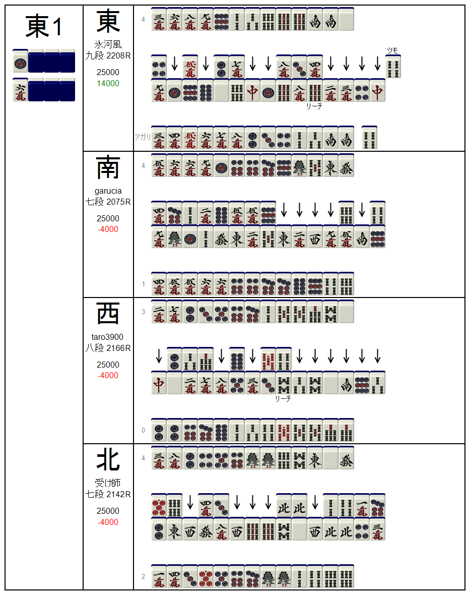

# TenhouViewer

Tool for search examples from tenhou replays and draw paifu.

## Usage
```
TenhouViewer -DHash - download game;
TenhouViewer -dLog.txt - download all games from log Log.txt;
TenhouViewer -PHash - parse game;
TenhouViewer -pLog.txt - parse all games from log Log.txt;
TenhouViewer -fLog.txt - find games from log Log.txt with query:
 shanten=N - find all hands started with N shanten number (0-6);
 shantenmin=N - find all hands started with shanten number greater (or equal) than N (0-6);
 shantenmax=N - find all hands started with shanten number less (or equal) than N (0-6);
 ratingmin=N - find all players, who has rating greater (or equal) than N (1000-3000);
 ratingmax=N - find all players, who has rating less (or equal) than N (1000-3000);
 paymentmin=N - find all players, who receive or pay greater (or equal) than N pt (-1000000-1000000);
 paymentmax=N - find all players, who receive or pay less (or equal) than N pt (-1000000-1000000);
 waitmin=N - find all hands which has N or greater sides of winning waiting (1-13);
 waitmax=N - find all hands which has N or less sides of winning waiting (1-13);
 hanmin=N - find all hands which has han count greater (or equal) than N (1-13);
 hanmax=N - find all hands which has han count less (or equal) than N (1-13);
 fumin=N - find all hands which has fu count greater (or equal) than N (1-120);
 fumax=N - find all hands which has fu count less (or equal) than N (1-120);
 place=N - find all players, who took N place (1-4);
 rank=N - find all players, who has rank N (0-20);
 nickname=N - find player, who has nickname N (string);
 steps=N - find all hands, who exist less (or equal) than N steps (0-60);
 yaku=N,M,X - find all hands, which has N,M,X,... yaku (0-54);
 wait=N,M,X - find all hands, which has at least one tile from list in waiting: N,M,X,... (0-36);
 dealer - find all dealer's hands;
 winner - find all completed hands;
 loser - find all players (games), who dealt into ron;
 players - count of players in game (3-4);
TenhouViewer -g<nickname> <fields> - graph rounds (which found by -f flag) with fields:
 index - round index in list;
 initshanten - shanten in start hand in round;
 pay - payment in round;
 tempai - is hand was tempai (1 or 0);
 dealer - is hand was dealer (1 or 0);
 loser - is player dealt in other hand (1 or 0);
 winner - is hand completed (1 or 0);
 riichi - is riichi declared (1 or 0);
 concealed - is hand was concealed (1 or 0);
 openedsets - amount of opened sets;
 cost - cost of hand;
 fu - count of minipoints in hand;
 han - count of game points in hand;
 step - count of steps to end in round;
 balance - balance in hand (pts);
 waiting - amount of tile types in waiting;
 round - index of round(0=1e,1=2e,2=3e...);
 players - count of players in round;
 draw - round ended in draw;
 draw=N - round ended in draw with reason (yao9,reach4,ron3,kan4,kaze4,nm);
TenhouViewer -G<nickname> <fields> - graph games (which found by -f flag) with fields:
 index - game index in list;
 rating - player rating before this game;
 rank - player rank before this game (1=1ku, 10=1dan,...);
 place - place in game;
 result - game result with uma;
 balance - balance in the end of game;
 players - count of players in game;
 datetime - date of game;
TenhouViewer -o<nickname> <fields> - format output results:
 link - link to the round;
 nickname - nickname of the player;
 rating - rating of the player;
 rank - rank of the player;
 place - place (result) in game;
 pay - player payment in round;
 dealer - is player dealer;
 winner - is player complete hand;
 loser - is player dealt in other player's hand;
 concealed - is hand concealed;
 cost - cost of hand;
 han - amount of game points in hand;
 waiting - amount of tile types in waiting;
 step - amount of player steps in round;
 yaku - list of yaku;
 round - current round (0-1e, 1-2e, ...);
 roundindex - index of round in game;
 place - player's place in game;
TenhouViewer -s<filename> - save find or graph result to specified file;
TenhouViewer -U<hash> <params> - get paifu:
 dir - directory to save result (for all rounds);
 filename - filename to save result (for specified round, without extension);
 round - round index (from 0);
TenhouViewer -u <params> - get paifu for all rounds, which was found before:
 dir - directory to save result (for all rounds);
 ```

# Examples
## Prepare of data
01. Download replays from log copied from tenhou application:
 ```
 TenhouViewer -dlog.txt
 ```
 
 Example of log.txt:
 ```
 00:00 | 05 | 三鳳南喰赤－ | <a href="http://tenhou.net/0/?log=2013022000gm-00b9-0000-73f9f276">牌譜</a> | Ixy0411(+76.0) ゆかこき(-5.0) garu47(-71.0)<br>
00:00 | 19 | 四鳳南喰赤－ | <a href="http://tenhou.net/0/?log=2013022000gm-00a9-0000-3827d34d">牌譜</a> | ヤキン(+50.0) ツレオ(+12.0) ♪ウサギ♪(-18.0) wadopro(-44.0)<br>
00:03 | 20 | 四鳳東喰赤－ | <a href="http://tenhou.net/0/?log=2013022000gm-00e1-0000-b946ce74">牌譜</a> | ケロンパス(+44.0) (∩・ω・)∩(+6.0) evacania(-15.0) ３ｐがツモれない(-35.0)<br>
00:03 | 25 | 四鳳南喰赤－ | <a href="http://tenhou.net/0/?log=2013022000gm-00a9-0000-09d5cc73">牌譜</a> | chubu74(+65.0) いい笑顔(+12.0) 竹田誠志(-23.0) ROLLY(-54.0)<br>
 ```
Prepare all replays for search and other actions:
 ```
 TenhouViewer -plog.txt
 ```
## Hand search
### 1. Search for dealer mangan hands
Search rounds and players with such conditions: minimal payment to winner, player is winner, player is dealer. In output file dealermangan.txt save: tenhou replay link to specified round from specified user's pov, user's nickname, hand's cost, hand's waiting and hand's yaku.
 ```
TenhouViewer -flog.txt winner paymentmin=12000 dealer -o link nickname cost waiting yaku -sdealermangan.txt
 ```
Example of output:
```
http://tenhou.net/0/?log=2013022000gm-00b9-0000-bcaa792e&ts=0&tw=0	うさぷー	12000	0	Riichi Ippatsu Menzen Tsumo Pinfu Dora 	
http://tenhou.net/0/?log=2013022000gm-00b9-0000-bcaa792e&ts=7&tw=2	Simoon	12000	0	Menzen Tsumo Pinfu Itsuu Dora Aka-dora 	
http://tenhou.net/0/?log=2013022000gm-00a9-0000-0a5439a5&ts=9&tw=2	西村雄一郎	12000	2	Riichi Menzen Tsumo Pinfu Ippeiko Tanyao 	
http://tenhou.net/0/?log=2013022000gm-00b9-0000-8dd718f0&ts=3&tw=2	ロジカルさん	12000	4	Riichi Dora Ura-dora 	
http://tenhou.net/0/?log=2013022000gm-00b9-0000-8dd718f0&ts=5&tw=0	いちごポッキー	18000	0	Riichi Ippatsu Itsuu Dora 
```

### 2. Paifu found hands
Search rounds and players with such conditions: minimal payment to winner, player is winner, player is dealer. Output rounds as paifu in directory 'dealermangan'
```
TenhouViewer -flog.txt winner dealer paymentmin=12000 -u dir=dealermangan
```
Example of paifu:

